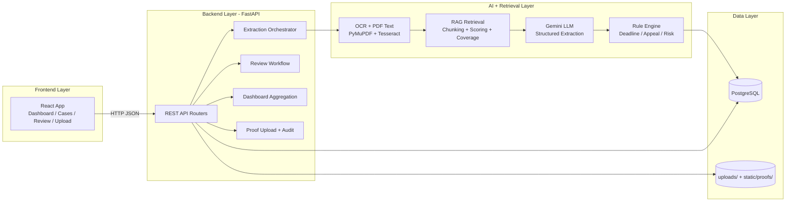
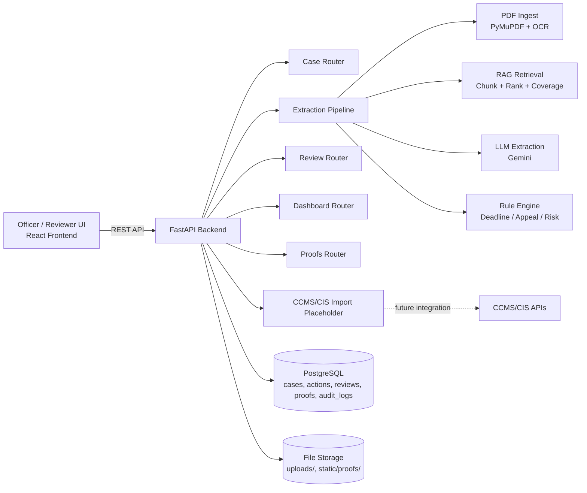
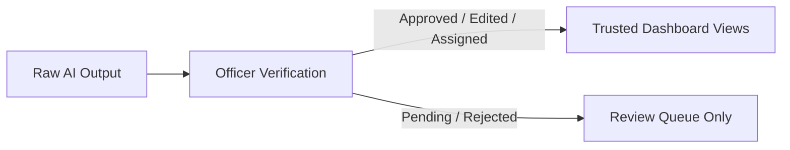

# TirpuKaryaSetu AI - Architecture & Workflow

## 1) Technical Architecture (Frontend, Backend, AI, RAG)



### Where AI is used

- `LLM extraction`: Gemini converts judgment text into structured output:
  - case metadata
  - action items
  - source evidence snippets
- `OCR`: used when PDF text layer is missing/low-signal.
- `Rule engine`: deterministic enrichment over AI output (deadlines, appeal window, risk flags).

### Where RAG is used

- In the extraction pipeline before LLM call:
  - document text is chunked
  - chunks are ranked by legal-direction keywords
  - coverage chunks are added across start/middle/end of long judgments
- LLM receives retrieved chunks (not only first pages), improving grounding and long-document handling.

---

## 2) High-Level Architecture



---

## 3) End-to-End Workflow (Judgment to Verified Action)

```mermaid
flowchart TD
    A[Upload Judgment PDF / Import CCMS Case] --> B[Create Case Record\nstatus=pending]
    B --> C[Extract Text\nNative PDF text + OCR fallback]
    C --> D[RAG Retrieval across document]
    D --> E[AI Extraction\nmetadata + actions + evidence]
    E --> F[Rule Enrichment\nrisk/deadline/appeal]
    F --> G[Save Actions + Extractions\nstatus=pending_review]

    G --> H[Review Queue]
    H --> I1[Approve]
    H --> I2[Edit / Mark Edited]
    H --> I3[Assign]
    H --> I4[Reject]

    I1 --> J[Verified Action State]
    I2 --> J
    I3 --> J
    I4 --> K[Rejected (not actionable)]

    J --> L[Execution by Department]
    L --> M[Proof Upload]
    M --> N[Mark Completed / Close]
    N --> O[Dashboard + Audit Trail]
```

---

## 4) Trusted Dashboard Rule



---

## 5) Key Components

- Frontend (`React`): Dashboard, Cases, Review Queue, Upload, Proof Upload, bilingual UI.
- Backend (`FastAPI`): API orchestration, extraction trigger, review workflow, proofs, audit.
- Extraction stack:
  - PDF text extraction (`PyMuPDF`)
  - OCR fallback (`Tesseract`)
  - RAG retrieval over full document chunks
  - LLM structured extraction (`Gemini`)
  - Rule engine enrichment for compliance timelines/risk
- Data layer (`PostgreSQL`): case-centric records and traceability.
- Evidence storage: uploaded PDFs and compliance proof files.

---

## 6) Auditability and Explainability

- Every action item is stored with source evidence (and page when available).
- Review actions (approve/edit/assign/reject) are tracked.
- Case lifecycle events are recorded in audit logs.
- Dashboard is intended to represent officer-validated workflow state.
